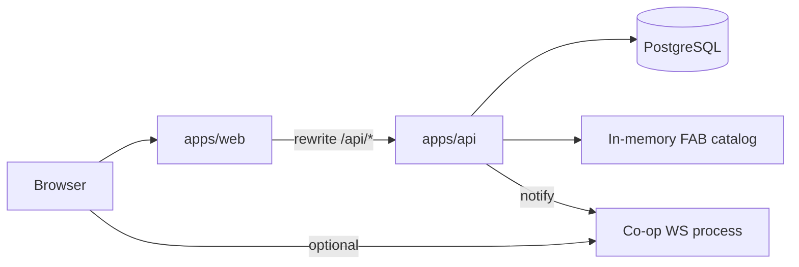

# Architecture overview

English reference for developers and AI agents. For onboarding in Spanish, see **[HANDOFF.md](./HANDOFF.md)**.

## Monorepo layout

```
guess-a-card-any-card/
├── apps/
│   ├── web/                 # Next.js 16 App Router
│   └── api/                 # Hono HTTP API + Prisma
├── packages/
│   └── shared/              # Reveal engine, coop WS types, shared utils
├── docs/                    # Human docs (start at HANDOFF.md)
├── vitest.config.ts         # Multi-project tests (web, api, shared)
└── package.json             # npm workspaces root
```

## Runtime diagram



## Three product surfaces (one auth account)

| Brand | `experience-brand.ts` | Web prefix | API namespace |
|-------|----------------------|------------|---------------|
| Codex | `codex` | `/`, `/profile`, `/u/[id]` | `/api/profile` (global) |
| Guess | `guess` | `/single`, `/challenge`, … | `/api/single`, `/api/challenges`, `/api/leaderboard`, … |
| Fragments | `fragments` | `/puzzle/*` | `/api/fragments/*` |

Headers and backgrounds switch via `getBrandFromPathname()` and layout components (`PublicHeader`, `FragmentsHeader`, `CodexHeader`).

## Card catalog (critical)

- Source: `@flesh-and-blood/cards`
- Built at API startup: `initCardCatalog()` in `http-app.ts`
- Filtering: excludes tokens, marvel, promo, bad foils, back images, etc. (`card-catalog-service.ts`)
- Games store **snapshots** on `Game` rows (`cardId`, `cardName`, `cardSet`, …) — no puzzle tables

If catalog load fails at boot, gameplay routes should not be considered healthy.

## API route map (`/api` prefix)

| Mount | File | Domain |
|-------|------|--------|
| `/health` | `http-app.ts` | Liveness |
| `/me` | `me-routes.ts` | Current user |
| `/profile` | `profile-routes.ts` | Codex / Guess public profiles |
| `/leaderboard` | `leaderboard-routes.ts` | **Guess only** |
| `/single` | `single-player-routes.ts` | Single player games |
| `/challenges` | `challenge-routes.ts` | Challenge links |
| `/coop` | `coop-routes.ts` | Co-op rooms |
| `/competitive` | `competitive-routes.ts` | Competitive races |
| `/catalog` | `catalog-routes.ts` | Sets, search, random card |
| `/fragments` | `fragments-routes.ts` | Fragments completions, profiles, leaderboards |

## Auth model

- **Guest:** `x-guest-id` header (generated client-side)
- **User:** Supabase JWT in `Authorization`; API validates via JWKS (`resolve-actor.ts`)
- Fragments completions only persist for `actor.kind === "user"`

## Database ownership

- Schema: `apps/api/prisma/schema.prisma`
- Migrations: `apps/api/prisma/migrations/`
- Deploy: `npm run db:deploy` from repo root
- Generated client: `apps/api/src/generated/prisma` (not in git)

See **[database.md](./database.md)**.

## Local development defaults

| Service | Port | Command |
|---------|------|---------|
| API | 8787 | `npm run dev:api` |
| Web | 3000 | `npm run dev` |
| Co-op WS | 3010 | `npm run realtime:dev` |

Next dev proxies `/api/*` → `http://127.0.0.1:8787` unless `API_PROXY_TARGET` is set (`next.config.ts`).

## Testing

```bash
npm test                 # all workspaces
cd apps/web && npx tsc --noEmit
cd apps/api && npx tsc --noEmit
```

## Key docs index

| Doc | Purpose |
|-----|---------|
| [HANDOFF.md](./HANDOFF.md) | Repo transfer / onboarding (ES) |
| [FRAGMENTS.md](./FRAGMENTS.md) | Fragments feature map |
| [BLUEPRINT_PRO.md](./BLUEPRINT_PRO.md) | Product vision (§0.1 = current catalog model) |
| [deploy.md](./deploy.md) | Vercel + Render/Netlify |
| [generated-files.md](./generated-files.md) | What not to commit |
